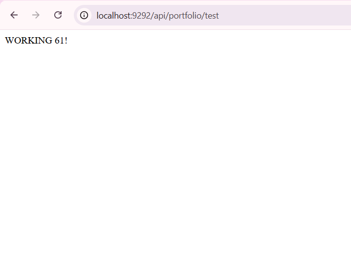
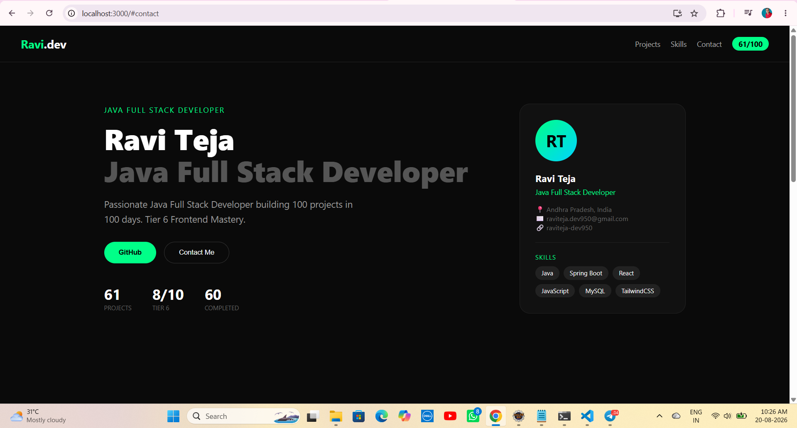
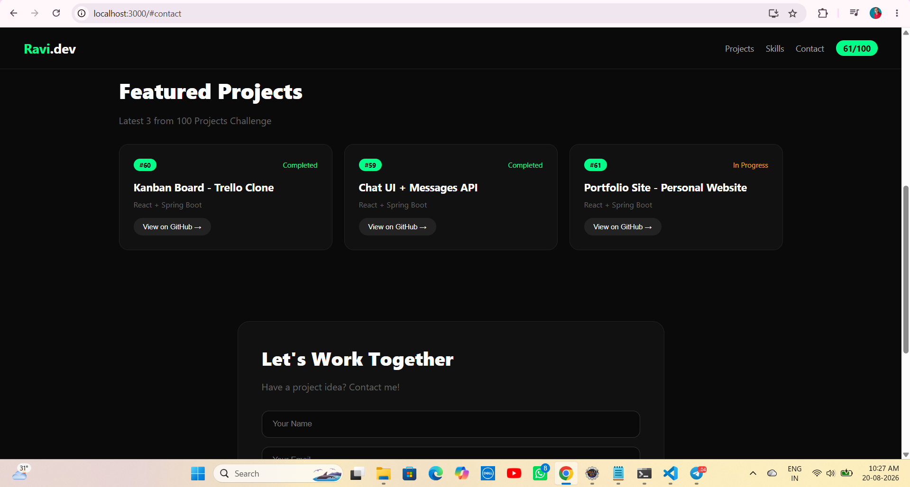
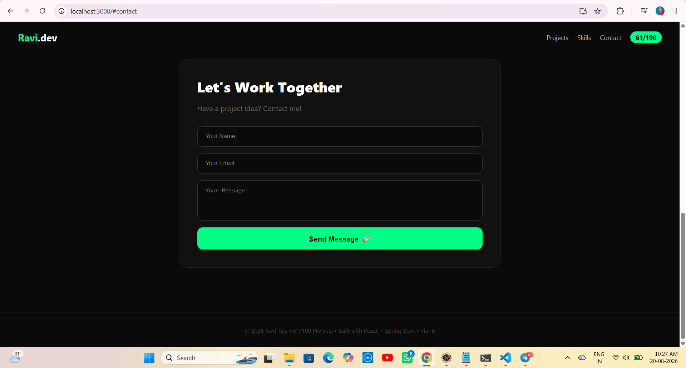

# 📋 Project 61 – Portfolio Site + Profile API | Personal Website | Single Repo

<p align="left">


</p>

---

# 📖 Project Overview

**Portfolio Site + Profile API | Personal Website** is **Project 61** of **Tier 6 – Frontend Mastery with React**, developed using **React 19**, **Spring Boot 3.3.3**, **TailwindCSS 3.4.1**, and **Axios** in a single monorepo.

React frontend runs on **port 3000** and communicates with the Spring Boot REST API running on **port 9292** through Axios.

The backend provides REST endpoints for:

- `GET /api/portfolio/test`
- `GET /api/portfolio/profile`
- `GET /api/portfolio/projects`
- `GET /api/portfolio/stats`
- `POST /api/portfolio/contact`

The frontend displays:

- Ravi.dev header
- 61/100 project badge
- Projects navigation
- Skills navigation
- Contact navigation
- Java Full Stack Developer label
- Hero section
- About section
- GitHub button
- Contact Me button
- Portfolio statistics
- Profile card
- Skills badges
- Featured projects
- Contact form
- Contact success message
- Footer

This project uses a **single repository architecture** containing both the backend and frontend.

### 🐛 Bug Fixed - Axios Network Error

The frontend running on port `3000` could not communicate with the backend running on port `9292`.

The issue was fixed by:

- Running Spring Boot on port `9292`
- Adding `@CrossOrigin(origins = "*")`
- Configuring Axios with the correct backend URL
- Using `http://localhost:9292/api`

### 🔧 Git Repository Fix

The embedded Git issue `160000` from previous projects was fixed by removing nested `.git` folders and keeping the entire project as one Git repository.

---

# ✨ Features

## 🧭 Header

- Ravi.dev branding
- Project 61 / 100 label
- Sticky header
- Projects navigation
- Skills navigation
- Contact navigation
- Smooth scrolling
- 61/100 green badge

## 🦸 Hero Section

- Java Full Stack Developer tag
- Ravi Teja name
- Professional introduction
- 100 Projects Challenge
- Tier 6 information
- GitHub button
- Contact Me button
- Smooth scroll navigation

## 📊 Statistics

- 61 Projects
- 8/10 Tier 6
- 60 Completed
- 1 In Progress

## 👤 Profile Card

- RT gradient avatar
- Location
- Email
- GitHub
- Skills badges

## 🛠 Skills

- Java
- Spring Boot
- React
- JavaScript
- MySQL
- TailwindCSS

## 🚀 Featured Projects

- #60 Kanban Board - Trello Clone
- #59 Chat UI + Messages API
- #61 Portfolio Site - Personal Website

Each project displays:

- Project number
- Project title
- Technology
- Status
- GitHub button

## 📬 Contact Form

- Let's Work Together section
- Your Name input
- Your Email input
- Your Message textarea
- Send Message button
- Form validation
- Axios POST request
- Success message

## 🎨 UI

- Dark theme
- `#0a0a0a` background
- `#00ff88` green accent
- `#111111` card background
- `#222222` border
- Responsive layout
- Flexbox
- CSS Grid
- Rounded cards
- Sticky header
- Smooth scrolling

## 🔌 API Integration

- Axios REST Client
- React Hooks
- `useState`
- `useEffect`
- GET requests
- POST requests
- CORS handling
- API-driven UI

## 📦 Architecture

- Single repository
- Spring Boot REST API
- React frontend
- Profile API
- Projects API
- Statistics API
- Contact API
- Test API

---

# 🛠 Technologies Used

| Technology | Version / Usage |
|---|---|
| React | 19.0.0 |
| Java | 21 |
| Spring Boot | 3.3.3 |
| TailwindCSS | 3.4.1 |
| Axios | 1.6+ |
| Spring Web | REST API |
| JavaScript | ES6+ |
| Node.js | Frontend Runtime |
| npm | Package Manager |
| Maven | 3.9+ |
| Apache Tomcat | 10.1.30 |
| VS Code | Development |
| STS | Backend Development |
| Eclipse IDE | Backend Development |

---

# 📂 Project Structure - Single Repo

```text
61-portfolio-site/
│
├── backend/
│   └── 61-portfolio-backend/
│       ├── src/
│       │   └── main/
│       │       ├── java/
│       │       │   └── com/
│       │       │       └── raviteja/
│       │       │           └── portfolio/
│       │       │               ├── PortfolioApplication.java
│       │       │               │
│       │       │               └── controller/
│       │       │                   └── PortfolioController.java
│       │       │
│       │       └── resources/
│       │           └── application.properties
│       │
│       └── pom.xml
│
├── frontend/
│   └── 61-portfolio-ui/
│       ├── public/
│       │   └── index.html
│       │
│       ├── src/
│       │   ├── api/
│       │   │   └── api.js
│       │   │
│       │   ├── components/
│       │   │   └── Portfolio.jsx
│       │   │
│       │   ├── App.js
│       │   ├── index.js
│       │   └── index.css
│       │
│       ├── package.json
│       └── package-lock.json
│
├── screenshots/
│   ├── demo1.png
│   ├── demo2.png
│   ├── demo3.png
│   └── demo4.png
│
├── .gitignore
└── README.md
```

---

# ▶ How to Run - Single Repo

## 1️⃣ Clone the Repository

```bash
git clone https://github.com/raviteja-dev950/61-portfolio-site.git
cd 61-portfolio-site
```

## 2️⃣ Run Backend First - Port 9292

Open **STS / Eclipse IDE**.

Import:

```text
backend/61-portfolio-backend
```

as an **Existing Maven Project**.

Verify:

```text
backend/61-portfolio-backend/src/main/resources/application.properties
```

Use:

```properties
server.port=9292
spring.application.name=portfolio-api
```

## 3️⃣ PortfolioController.java

Verify:

```text
backend/61-portfolio-backend/src/main/java/com/raviteja/portfolio/controller/PortfolioController.java
```

Use:

```java
package com.raviteja.portfolio.controller;

import java.util.ArrayList;
import java.util.Arrays;
import java.util.HashMap;
import java.util.List;
import java.util.Map;

import org.springframework.web.bind.annotation.CrossOrigin;
import org.springframework.web.bind.annotation.GetMapping;
import org.springframework.web.bind.annotation.PostMapping;
import org.springframework.web.bind.annotation.RequestBody;
import org.springframework.web.bind.annotation.RequestMapping;
import org.springframework.web.bind.annotation.RestController;

@RestController
@RequestMapping("/api/portfolio")
@CrossOrigin(origins = "*")
public class PortfolioController {

    @GetMapping("/test")
    public String test() {
        return "WORKING 61!";
    }

    @GetMapping("/profile")
    public Map<String, Object> getProfile() {

        Map<String, Object> profile = new HashMap<>();

        profile.put("name", "Ravi Teja");
        profile.put("role", "Java Full Stack Developer");
        profile.put("location", "Andhra Pradesh, India");
        profile.put("experience", "100 Projects Challenge - 61/100");
        profile.put("email", "raviteja.dev950@gmail.com");
        profile.put("github", "raviteja-dev950");

        profile.put(
            "about",
            "Passionate Java Full Stack Developer building 100 projects in 100 days. Tier 6 Frontend Mastery."
        );

        profile.put(
            "skills",
            Arrays.asList(
                "Java",
                "Spring Boot",
                "React",
                "JavaScript",
                "MySQL",
                "TailwindCSS"
            )
        );

        return profile;
    }

    @GetMapping("/projects")
    public List<Map<String, Object>> getProjects() {

        List<Map<String, Object>> projects = new ArrayList<>();

        Map<String, Object> p60 = new HashMap<>();
        p60.put("id", 60);
        p60.put("title", "Kanban Board - Trello Clone");
        p60.put("tech", "React + Spring Boot");
        p60.put("status", "Completed");
        p60.put(
            "link",
            "https://github.com/raviteja-dev950/60-kanban-board"
        );
        projects.add(p60);

        Map<String, Object> p59 = new HashMap<>();
        p59.put("id", 59);
        p59.put("title", "Chat UI + Messages API");
        p59.put("tech", "React + Spring Boot");
        p59.put("status", "Completed");
        p59.put(
            "link",
            "https://github.com/raviteja-dev950/59-chat-ui"
        );
        projects.add(p59);

        Map<String, Object> p61 = new HashMap<>();
        p61.put("id", 61);
        p61.put("title", "Portfolio Site - Personal Website");
        p61.put("tech", "React + Spring Boot");
        p61.put("status", "In Progress");
        p61.put(
            "link",
            "https://github.com/raviteja-dev950/61-portfolio-site"
        );
        projects.add(p61);

        return projects;
    }

    @GetMapping("/stats")
    public Map<String, Object> getStats() {

        Map<String, Object> stats = new HashMap<>();

        stats.put("totalProjects", 61);
        stats.put("tier", "Tier 6");
        stats.put("completed", 60);
        stats.put("inProgress", 1);
        stats.put("tierProgress", "8/10");

        return stats;
    }

    @PostMapping("/contact")
    public Map<String, Object> contact(
            @RequestBody Map<String, String> payload) {

        Map<String, Object> response = new HashMap<>();

        String name = payload.get("name");
        String email = payload.get("email");

        response.put(
            "message",
            "Thanks " + name + "! Message received! I will reply soon!"
        );

        response.put("email", email);
        response.put("status", "success");

        return response;
    }
}
```

## 4️⃣ Run Backend

Right-click the project.

Select:

```text
Run As → Spring Boot App
```

Check the console:

```text
Tomcat initialized with port 9292 (http)
Tomcat started on port 9292 (http) with context path '/'
Started PortfolioApplication
```

Open:

```text
http://localhost:9292/api/portfolio/test
```

Expected:

```text
WORKING 61!
```

Open:

```text
http://localhost:9292/api/portfolio/profile
```

The backend should return JSON.

---

## 5️⃣ Run Frontend - Port 3000

Open a new terminal.

```bash
cd frontend/61-portfolio-ui
npm install
npm install axios
npm start
```

The React application starts on:

```text
http://localhost:3000
```

---

## 6️⃣ Axios API Configuration

Verify:

```text
frontend/61-portfolio-ui/src/api/api.js
```

Use:

```javascript
import axios from "axios";

const api = axios.create({
    baseURL: "http://localhost:9292/api"
});

export default api;
```

---

# 🔄 Application Flow

```text
User
  │
  ▼
React Portfolio UI
localhost:3000
  │
  ▼
Portfolio.jsx
  │
  ├── useState
  ├── useEffect
  ├── Axios
  └── Portfolio Logic
  │
  ├── GET /api/portfolio/profile
  ├── GET /api/portfolio/projects
  ├── GET /api/portfolio/stats
  ├── POST /api/portfolio/contact
  └── GET /api/portfolio/test
  │
  ▼
Spring Boot REST API
localhost:9292
  │
  ▼
PortfolioController
  │
  ├── Profile
  ├── Projects
  ├── Stats
  ├── Contact
  └── Test
  │
  ▼
React Portfolio Interface
  │
  ├── Header
  │   ├── Ravi.dev
  │   ├── Projects
  │   ├── Skills
  │   ├── Contact
  │   └── 61/100 Badge
  │
  ├── Hero Section
  │   ├── Java Full Stack Developer
  │   ├── Ravi Teja
  │   ├── About
  │   ├── GitHub
  │   ├── Contact
  │   └── Statistics
  │
  ├── Profile Card
  │   ├── RT Avatar
  │   ├── Location
  │   ├── Email
  │   ├── GitHub
  │   └── Skills
  │
  ├── Featured Projects
  │   ├── #60 Kanban
  │   ├── #59 Chat UI
  │   └── #61 Portfolio
  │
  ▼
Contact Form
  │
  ├── Name
  ├── Email
  ├── Message
  └── Send Message
  │
  ▼
POST /api/portfolio/contact
  │
  ▼
Success Message
  │
  ▼
Footer
```

---

# 📊 Portfolio Statistics

| Statistic | Value | Type |
|---|---:|---|
| Total Projects | 61 | Count |
| Tier Progress | 8/10 | Tier 6 |
| Completed | 60 | Count |
| In Progress | 1 | Count |

---

# 📋 Default Profile Data

| Field | Value |
|---|---|
| Name | Ravi Teja |
| Role | Java Full Stack Developer |
| Location | Andhra Pradesh, India |
| Email | raviteja.dev950@gmail.com |
| GitHub | raviteja-dev950 |
| About | Passionate Java Full Stack Developer building 100 projects in 100 days. Tier 6 Frontend Mastery. |

---

# 📂 Default Projects Data

| ID | Title | Tech | Status |
|---:|---|---|---|
| 60 | Kanban Board - Trello Clone | React + Spring Boot | Completed |
| 59 | Chat UI + Messages API | React + Spring Boot | Completed |
| 61 | Portfolio Site - Personal Website | React + Spring Boot | In Progress |

---

# 📨 Contact Form Example

```text
Name: John Doe
Email: john@example.com
Message: Love your portfolio! Let's collaborate.
```

After clicking **Send Message**:

```text
Thanks John Doe! Message received! I will reply soon!
```

---

# 🧪 API Testing Examples

## GET Test

```bash
curl http://localhost:9292/api/portfolio/test
```

## GET Profile

```bash
curl http://localhost:9292/api/portfolio/profile
```

## GET Projects

```bash
curl http://localhost:9292/api/portfolio/projects
```

## GET Stats

```bash
curl http://localhost:9292/api/portfolio/stats
```

## POST Contact

```bash
curl -X POST http://localhost:9292/api/portfolio/contact -H "Content-Type: application/json" -d "{\"name\":\"John\",\"email\":\"john@example.com\",\"message\":\"Hi\"}"
```

---

# 📡 API Endpoints

| Method | Endpoint | Description |
|---|---|---|
| GET | `/api/portfolio/test` | Test API is working |
| GET | `/api/portfolio/profile` | Get profile information |
| GET | `/api/portfolio/projects` | Get featured projects |
| GET | `/api/portfolio/stats` | Get portfolio statistics |
| POST | `/api/portfolio/contact` | Send contact message |

---

# 📥 Expected Test Response

```text
WORKING 61!
```

---

# 📦 Expected Profile Response

```json
{
  "name": "Ravi Teja",
  "role": "Java Full Stack Developer",
  "location": "Andhra Pradesh, India",
  "experience": "100 Projects Challenge - 61/100",
  "email": "raviteja.dev950@gmail.com",
  "github": "raviteja-dev950",
  "about": "Passionate Java Full Stack Developer building 100 projects in 100 days. Tier 6 Frontend Mastery.",
  "skills": [
    "Java",
    "Spring Boot",
    "React",
    "JavaScript",
    "MySQL",
    "TailwindCSS"
  ]
}
```

---

# 📊 Expected Stats Response

```json
{
  "totalProjects": 61,
  "tier": "Tier 6",
  "completed": 60,
  "inProgress": 1,
  "tierProgress": "8/10"
}
```

---

# 📦 Expected Projects Response

```json
[
  {
    "id": 60,
    "title": "Kanban Board - Trello Clone",
    "tech": "React + Spring Boot",
    "status": "Completed",
    "link": "https://github.com/raviteja-dev950/60-kanban-board"
  },
  {
    "id": 59,
    "title": "Chat UI + Messages API",
    "tech": "React + Spring Boot",
    "status": "Completed",
    "link": "https://github.com/raviteja-dev950/59-chat-ui"
  },
  {
    "id": 61,
    "title": "Portfolio Site - Personal Website",
    "tech": "React + Spring Boot",
    "status": "In Progress",
    "link": "https://github.com/raviteja-dev950/61-portfolio-site"
  }
]
```

---

# 📨 Expected Contact Response

```json
{
  "message": "Thanks John! Message received! I will reply soon!",
  "email": "john@example.com",
  "status": "success"
}
```

---

# 🧪 Frontend Testing

## Test 1 - Backend Test

Open:

```text
http://localhost:9292/api/portfolio/test
```

Verify:

```text
WORKING 61!
```

## Test 2 - Backend Profile

Open:

```text
http://localhost:9292/api/portfolio/profile
```

Verify the profile JSON response.

## Test 3 - Frontend Portfolio UI

Open:

```text
http://localhost:3000
```

Verify:

- Ravi.dev header
- 61/100 badge
- Hero section with Ravi Teja
- Stats 61, 8/10, 60
- Profile card with RT avatar
- Skills badges

## Test 4 - Navigation

Click **Projects**.

Verify:

```text
Scrolls to Featured Projects
```

Click **Skills**.

Verify:

```text
Scrolls to Skills section
```

Click **Contact**.

Verify:

```text
Scrolls to Let's Work Together
```

## Test 5 - Contact Form

Enter:

```text
Name: Ravi
Email: test@gmail.com
Message: Hello
```

Click **Send Message**.

Verify:

```text
Thanks Ravi! Message received!
```

## Test 6 - Verify Colors

```text
Background → Dark #0a0a0a
Accent → Green #00ff88
Card → Dark #111111
Border → #222222
Completed → Green #00ff88
In Progress → Yellow #ffaa00
```

---

# 📸 Screenshots

## Demo 1 - Frontend Hero Section



## Demo 2 - Featured Projects + Contact Form



## Demo 3 - Backend Portfolio Test API



## Demo 4 - Contact Form Success



---

# 🎯 Learning Outcomes

- Understanding Full Stack Portfolio application architecture
- Understanding Single Repo / Monorepo architecture
- Creating REST APIs using Spring Boot
- Using `@RestController`
- Using `@RequestMapping`
- Using `@GetMapping`
- Using `@PostMapping`
- Creating `/api/portfolio/*` endpoints
- Configuring CORS using `@CrossOrigin`
- Connecting React with Spring Boot
- Using Axios for REST API communication
- Creating Axios instance with `baseURL`
- Using React `useState`
- Using React `useEffect`
- Fetching profile from backend
- Fetching projects from backend
- Fetching stats from backend
- Sending contact form through POST requests
- Managing portfolio state
- Creating controlled React inputs
- Creating sticky header
- Creating smooth scroll navigation
- Building hero section
- Building profile card
- Building project cards
- Implementing contact form logic
- Implementing skill badges
- Building dark theme UI
- Building Flexbox and Grid layouts
- Creating personal website UI
- Implementing API-driven UI updates
- Running React and Spring Boot simultaneously
- Running frontend on port 3000
- Running backend on port 9292
- Handling JSON data between React and Java
- Debugging Axios Network Error
- Understanding CORS issues
- Fixing nested Git repository issues
- Building a professional full-stack monorepo
- Understanding Monorepo vs Separate Repository architecture

---

# 🚀 Future Enhancements

- ➕ Add Download Resume button
- 🔍 Add Project Search
- 🏷 Add Blog section
- 👤 Add Experience timeline
- 📅 Add Certifications
- 💬 Add Testimonials
- 📎 Add Resume PDF view
- 🔄 Add Animations with Framer Motion
- 📊 Add GitHub stats graph
- 🌙 Add Dark / Light Theme toggle
- 🔐 Add Admin to edit profile
- 👑 Add JWT Authentication
- 🖼 Add Project images
- 🗄 Switch in-memory data to MySQL
- 🗄 Add Spring Data JPA
- ☁ Deploy Frontend to Vercel
- ☁ Deploy Backend to Render
- 🧪 Add Jest Tests
- 🧪 Add React Testing Library
- 📱 Improve Mobile Responsiveness
- ⏰ Add Animated counters
- 📈 Add Visitor counter
- ✏ Add Editable sections
- 🔔 Add EmailJS integration for real emails
- 💾 Add Portfolio CMS
- 👥 Add Social links

---

# 👨‍💻 Author

**Ravi Teja**

**Java Full Stack Developer**

**100 Java Full Stack Projects Challenge**

**Project 61 / 100**

**Tier 6 – Frontend Mastery with React**

**Monorepo - Backend + Frontend**

---

# ⭐ Support

If you found this project helpful, consider giving it a ⭐ Star on GitHub.

## Single Repo

https://github.com/raviteja-dev950/61-portfolio-site

## Backend

```text
backend/61-portfolio-backend/Port: 9292
```

## Frontend

```text
frontend/61-portfolio-ui/Port: 3000
```